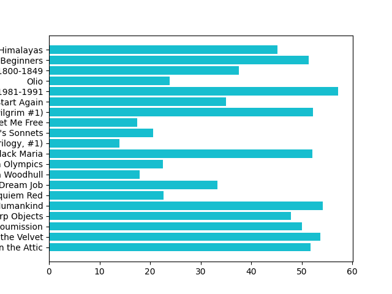

# Book Price Scraper & Visualization

A Python project that scrapes book titles and prices from https://books.toscrape.com, stores the data in a CSV file, and visualizes book prices using a bar chart using Matplotlib.

---

## Features

- Scrapes book titles and prices
- Stores scraped data in a CSV file
- Cleans and converts scraped price data
- Visualizes prices using a bar chart
- Reads and prints stored CSV data

---

## Technologies Used

- Python
- Requests
- BeautifulSoup4
- CSV
- Matplotlib

---

## Installation

Install the required libraries:

```bash
pip install requests beautifulsoup4 matplotlib
```

---

## How to Run

Run the Python file:

```bash
python main.py
```

The program will:
1. Scrape book titles and prices
2. Store the data in `output.csv`
3. Generate a bar graph of book prices

---

## Example Output

### CSV Output

| Title | Price |
|---|---|
| A Light in the Attic | 51.77 |
| Tipping the Velvet | 53.74 |

---

## Graph Output

Add your saved graph image here later.

```md

```

---

## What I Learned

- Web scraping using BeautifulSoup
- Extracting data from HTML tags and attributes
- Working with CSV files in Python
- Converting and cleaning scraped data
- Creating data visualizations using Matplotlib
- Structuring scraped data for multiple uses

---

## Future Improvements

- Add pagination support to scrape multiple pages
- Improve graph readability
- Add sorting by price
- Show average, highest, and lowest book prices
- Export graphs automatically as image files
- Use cleaner project structure with multiple files

---

## Project Structure

```text
project/
│
├── main.py
├── output.csv
├── graph.png
└── README.md
```